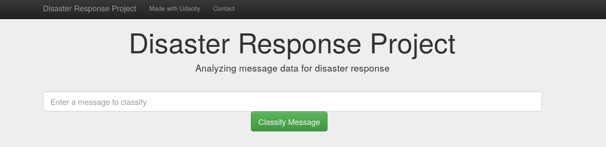
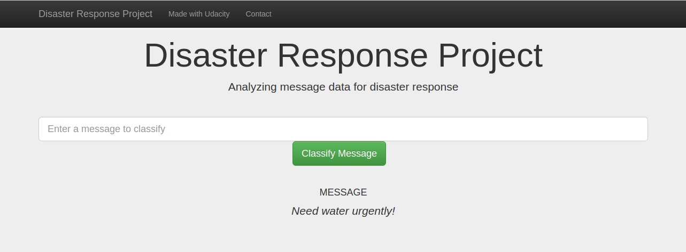
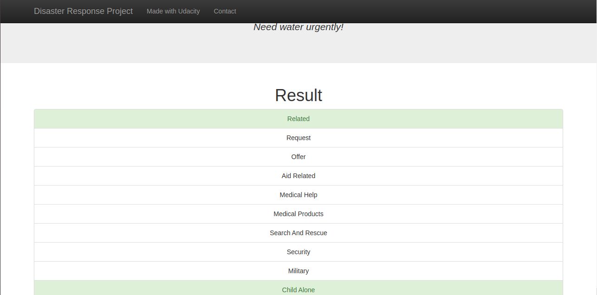
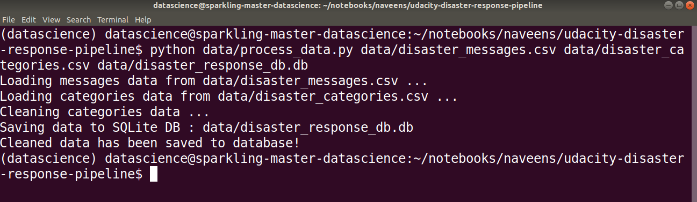
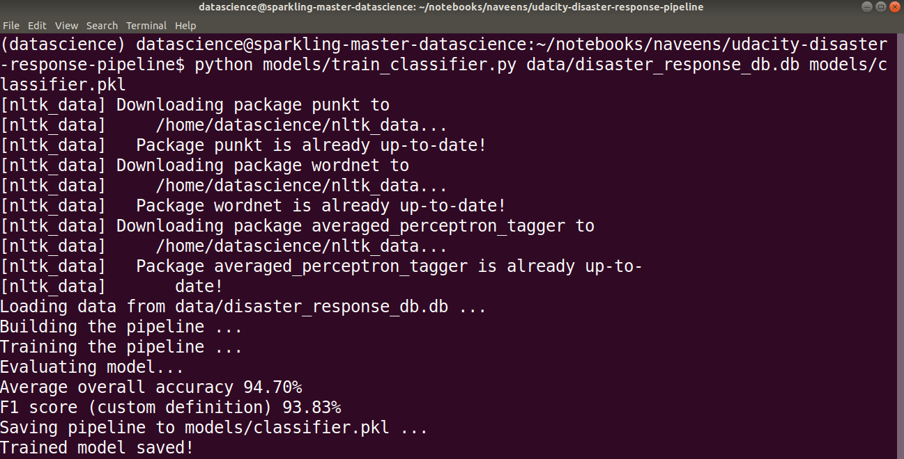

# Disaster Response Pipeline Project (Udacity - Data Science Nanodegree)




## Table of Contents
1. [Description](#description)
2. [Getting Started](#getting_started)
	1. [Dependencies](#dependencies)
	2. [Installing](#installation)
	3. [Executing Program](#execution)
	4. [Additional Material](#material)
3. [Authors](#authors)
4. [License](#license)
5. [Acknowledgement](#acknowledgement)
6. [Screenshots](#screenshots)

<a name="descripton"></a>
## Description

This Project is part of Data Science Nanodegree Program by Udacity in collaboration with Figure Eight. The dataset contains pre-labelled tweet and messages from real-life disaster events. The project aim is to build a Natural Language Processing (NLP) model to categorize messages on a real time basis.

This project is divided in the following key sections:

1. Processing data, building an ETL pipeline to extract data from source, clean the data and save them in a SQLite DB
2. Build a machine learning pipeline to train the which can classify text message in various categories
3. Run a web app which can show model results in real time

<a name="getting_started"></a>
## Getting Started

<a name="dependencies"></a>
### Dependencies
* Python 3.5+
* Machine Learning Libraries: NumPy, SciPy, Pandas, Sciki-Learn
* Natural Language Process Libraries: NLTK
* SQLlite Database Libraqries: SQLalchemy
* Model Loading and Saving Library: Pickle
* Web App and Data Visualization: Flask, Plotly

<a name="installation"></a>
### Installing
To clone the git repository:
```
git clone https://github.com/canaveensetia/udacity-disaster-response-pipeline.git
```
<a name="execution"></a>
### Executing Program:
1. You can run the following commands in the project's directory to set up the database, train model and save the model.

    - To run ETL pipeline to clean data and store the processed data in the database
        `python data/process_data.py data/disaster_messages.csv data/disaster_categories.csv data/disaster_response_db.db`
    - To run the ML pipeline that loads data from DB, trains classifier and saves the classifier as a pickle file
        `python models/train_classifier.py data/disaster_response_db.db models/classifier.pkl`

2. Run the following command in the app's directory to run your web app.
    `python run.py`

3. Go to http://0.0.0.0:3001/

<a name="material"></a>
### Additional Material

In the **data** and **models** folder you can find two jupyter notebook that will help you understand how the model works step by step:
1. **ETL Preparation Notebook**: learn everything about the implemented ETL pipeline
2. **ML Pipeline Preparation Notebook**: look at the Machine Learning Pipeline developed with NLTK and Scikit-Learn

You can use **ML Pipeline Preparation Notebook** to re-train the model or tune it through a dedicated Grid Search section.

<a name="importantfiles"></a>
### Important Files
**app/templates/***: templates/html files for web app

**data/process_data.py**: Extract Train Load (ETL) pipeline used for data cleaning, feature extraction, and storing data in a SQLite database

**models/train_classifier.py**: A machine learning pipeline that loads data, trains a model, and saves the trained model as a .pkl file for later use

**run.py**: This file can be used to launch the Flask web app used to classify disaster messages

<a name="authors"></a>
## Authors

* [Naveen Setia](https://github.com/canaveensetia)

<a name="license"></a>
## License
[](https://opensource.org/licenses/MIT)

<a name="acknowledgement"></a>
## Acknowledgements

* [Udacity](https://www.udacity.com/) for providing an amazing Data Science Nanodegree Program
* [Figure Eight](https://www.figure-eight.com/) for providing the relevant dataset to train the model

<a name="screenshots"></a>
## Screenshots

1. This is an example of a message we can type to test the performance of the model



2. After clicking **Classify Message**, we can see the categories which the message belongs to highlighted in green



3. The main page shows some graphs about training dataset, provided by Figure Eight


4. Sample run of process_data.py



5. Sample run of train_classifier.py



6. Sample run of train_classifier.py with precision, recall etc. for each category


